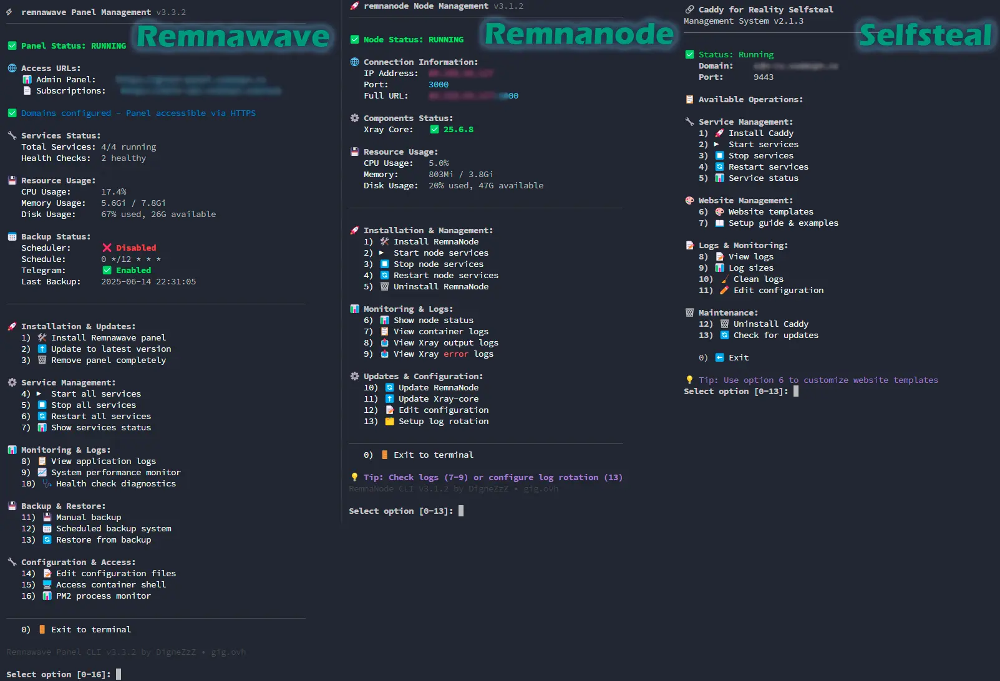

# Remnawave Скрипты

[ @ install

# Установка только скрипта управления  
bash <(curl -Ls https://github.com/DigneZzZ/remnawave-scripts/raw/main/remnawave.sh) @ install-script --name remnawave
```./LICENSE)
[](#)
[](#)
[](#-установщик-remnawave-panel)
[](#-установщик-remnanode)
[](#-система-резервного-копирования-и-восстановления)
[](#-caddy-selfsteal-для-reality)
[](#)
[](#)



Комплексная коллекция профессиональных Bash-скриптов для управления **Remnawave Panel**, **RemnaNode** и **маскировки трафика Reality**. Включает продвинутые возможности резервного копирования/восстановления, автоматическое планирование, интеграцию с Telegram и инструменты для production-развертывания.

## [Readme on ENGLISH](/README.md)

---

## 🧭 Меню навигации

<details>
<summary><b>📚 Содержание</b></summary>

### Основные установщики
* [🚀 Установщик Remnawave Panel](#-установщик-remnawave-panel)
* [🛰 Установщик RemnaNode](#-установщик-remnanode)
* [🎭 Caddy Selfsteal для Reality](#-caddy-selfsteal-для-reality)

### Система резервного копирования и миграции
* [💾 Система резервного копирования и восстановления](#-система-резервного-копирования-и-восстановления)
* [📅 Запланированные резервные копии](#-запланированные-резервные-копии)
* [🔄 Миграция и восстановление](#%EF%B8%8F-миграция-и-восстановление)
* [📱 Интеграция с Telegram](#-интеграция-с-telegram)

### Продвинутые функции
* [🔐 Функции безопасности](#-функции-безопасности)
* [🎛️ Команды управления](#%EF%B8%8F-команды-управления)
* [📊 Мониторинг и логи](#-мониторинг-и-логи)
* [⚙️ Системные требования](#%EF%B8%8F-системные-требования)

### Сообщество и поддержка
* [🤝 Участие в разработке](#-участие-в-разработке)
* [📜 Лицензия](#-лицензия)
* [👥 Сообщество](#-сообщество)

</details>

---

## 🚀 Установщик Remnawave Panel

Комплексный профессиональный Bash-скрипт для установки и управления [Remnawave Panel](https://github.com/remnawave/). Включает полную автоматизацию, продвинутые возможности резервного копирования/восстановления, запланированные операции и инструменты для production-развертывания.

### ✨ Ключевые особенности

**🎛️ Полное CLI управление**
* Полный командный интерфейс: `install`, `up`, `down`, `restart`, `logs`, `status`, `edit`, `update`, `uninstall`
* Интерактивное главное меню с цветным выводом
* Самообновление скрипта с проверкой версий
* Доступ к консоли внутреннего CLI панели

**🔧 Продвинутая установка**
* Автогенерация `.env`, секретов, портов и `docker-compose.yml`
* Поддержка режима разработки с флагом `--dev`
* Пользовательские пути установки и имена
* Автоматическое обнаружение и установка зависимостей
* Валидация системных требований

**💾 Корпоративная система резервного копирования и восстановления**
* **Полные системные бэкапы** со сжатием (.tar.gz)
* **Бэкапы только базы данных** (.sql, .sql.gz)
* **Запланированные бэкапы** с интеграцией cron
* **Полная система миграции** между серверами
* **Безопасные бэкапы** с автоматическим откатом
* **Политики хранения** с автоматической очисткой

**📱 Интеграция с Telegram**
* Уведомления бота для операций и запланированных бэкапов
* Поддержка больших файлов с частичной доставкой
* Поддержка тредов для групповых чатов
* Комплексные отчеты о статусе

---

### 📦 Быстрый старт

```bash
# Установка Remnawave Panel
sudo bash -c "$(curl -sL https://github.com/DigneZzZ/remnawave-scripts/raw/main/remnawave.sh)" @ install

# Установка только скрипта управления
sudo bash -c "$(curl -sL https://github.com/DigneZzZ/remnawave-scripts/raw/main/remnawave.sh)" @ install-script --name remnawave
```

---

### ⚙️ Параметры установки

| Флаг | Описание | Пример |
|------|----------|--------|
| `--name` | Пользовательское имя директории установки | `--name panel-prod` |
| `--dev` | Установка версии для разработки | `--dev` |
| `--path` | Пользовательский базовый путь установки | `--path /home/user` |

**Примеры:**
```bash
# Установка для разработки с пользовательским именем
sudo remnawave.sh install --name remnawave-dev --dev

# Production установка в пользовательский путь
sudo remnawave.sh install --name panel-prod --path /home/user
```

---

### 🛠 Команды управления

#### Основные операции
| Команда | Описание | Использование |
|---------|----------|---------------|
| `install` | Установить Remnawave Panel | `remnawave install [--dev] [--name NAME]` |
| `update` | Обновить скрипт и контейнеры | `remnawave update` |
| `uninstall` | Полностью удалить панель | `remnawave uninstall` |
| `up` | Запустить все сервисы | `remnawave up` |
| `down` | Остановить все сервисы | `remnawave down` |
| `restart` | Перезапустить панель | `remnawave restart` |
| `status` | Показать статус сервисов | `remnawave status` |

#### Конфигурация и обслуживание
| Команда | Описание | Использование |
|---------|----------|---------------|
| `edit` | Редактировать docker-compose.yml | `remnawave edit` |
| `edit-env` | Редактировать .env файл | `remnawave edit-env` |
| `logs` | Просмотреть логи контейнеров | `remnawave logs [--follow]` |
| `console` | Доступ к CLI консоли панели | `remnawave console` |

#### Система резервного копирования
| Команда | Описание | Использование |
|---------|----------|---------------|
| `backup` | Создать ручной бэкап | `remnawave backup [--compress] [--data-only]` |
| `restore` | Восстановить из бэкапа | `remnawave restore [--file FILE] [--database-only]` |
| `schedule` | Управлять запланированными бэкапами | `remnawave schedule` |

---

### 💾 Система резервного копирования и восстановления

#### Ручные бэкапы
```bash
# Полный системный бэкап со сжатием
remnawave backup --compress

# Бэкап только базы данных
remnawave backup --data-only

# Быстрый бэкап базы данных
remnawave backup --data-only --compress
```

#### Запланированные бэкапы
```bash
# Настройка автоматических бэкапов
remnawave schedule

# Доступные варианты планирования:
# - Ежедневные, еженедельные, ежемесячные интервалы
# - Настройки сжатия
# - Политики хранения (дни, минимальные бэкапы)
# - Конфигурация доставки через Telegram
```

#### Миграция и восстановление
```bash
# Полная миграция системы
remnawave restore --file backup.tar.gz --name newpanel --path /opt

# Восстановление только базы данных
remnawave restore --database-only --file database.sql.gz

# Восстановление с безопасным бэкапом
remnawave restore --file backup.tar.gz  # Автоматически создается безопасный бэкап
```

---

### 📱 Интеграция с Telegram

Настройка во время установки или через `.env`:

```bash
# Включить уведомления Telegram
IS_TELEGRAM_NOTIFICATIONS_ENABLED=true
TELEGRAM_BOT_TOKEN=your_bot_token

# Уведомления пользователей
TELEGRAM_NOTIFY_USERS_CHAT_ID=your_chat_id
TELEGRAM_NOTIFY_USERS_THREAD_ID=thread_id  # Опционально

# Уведомления узлов
TELEGRAM_NOTIFY_NODES_CHAT_ID=your_chat_id
TELEGRAM_NOTIFY_NODES_THREAD_ID=thread_id  # Опционально

# OAuth интеграция
TELEGRAM_OAUTH_ENABLED=true
TELEGRAM_OAUTH_ADMIN_IDS=123456789,987654321
```

**Функции:**
- Уведомления о завершении бэкапов
- Оповещения о статусе системы
- Доставка больших файлов (>50MB) частями
- Поддержка тредов для организованных групповых чатов

---

### 🌍 Production развертывание

**Настройка обратного прокси**
```nginx
# Пример Nginx
server {
    server_name panel.example.com;
    location / {
        proxy_pass http://127.0.0.1:3000;
        proxy_set_header Host $host;
        proxy_set_header X-Real-IP $remote_addr;
    }
}

server {
    server_name sub.example.com;
    location /sub {
        proxy_pass http://127.0.0.1:3010;
        proxy_set_header Host $host;
    }
}
```

**Переменные окружения**
```bash
# Домен доступа к панели
FRONT_END_DOMAIN=panel.example.com

# Домен подписки (без протокола)
SUB_PUBLIC_DOMAIN=sub.example.com

# Производительность базы данных
API_INSTANCES=2  # Количество API экземпляров
```

---

### 📂 Структура файлов

```text
/opt/remnawave/                    # Установка по умолчанию
├── .env                          # Основная конфигурация
├── .env.subscription             # Конфигурация страницы подписки
├── docker-compose.yml            # Оркестрация контейнеров
├── app-config.json              # Опциональная конфигурация приложения
├── backup-config.json           # Конфигурация системы бэкапов
├── backup-scheduler.sh          # Скрипт автоматического бэкапа
├── backups/                     # Хранилище бэкапов
│   ├── remnawave_full_*.tar.gz  # Полные системные бэкапы
│   ├── remnawave_db_*.sql.gz    # Бэкапы базы данных
│   └── remnawave_scheduled_*    # Автоматические бэкапы
└── logs/                        # Системные логи
    ├── backup.log               # Лог операций бэкапа
    └── panel.log               # Лог операций панели

/usr/local/bin/remnawave          # Скрипт управления
```

---

## 🛰 Установщик RemnaNode

Production-готовый Bash-скрипт для установки и управления **RemnaNode** - высокопроизводительными прокси-узлами с продвинутой интеграцией Xray-core. Разработан для бесшовного подключения к Remnawave Panel с функциями корпоративного уровня.

### ✨ Ключевые особенности

**🎛️ Полное управление узлами**
* Полный CLI интерфейс: `install`, `up`, `down`, `restart`, `status`, `logs`, `update`, `uninstall`
* Интерактивное главное меню с адаптивным размером терминала
* Автоматическое обнаружение и разрешение конфликтов портов
* Мониторинг логов в реальном времени для Xray-core

**⚡ Продвинутая интеграция Xray-core**
* Автоматическое обнаружение и установка последней версии
* Интерактивный выбор версии с поддержкой pre-release
* Управление пользовательскими бинарными файлами Xray-core
* Потоковое отображение логов в реальном времени (`xray_log_out`, `xray_log_err`)

**🔧 Production функции**
* Ротация логов с настраиваемым хранением
* Поддержка мультиархитектуры (x86_64, ARM64, ARM32, MIPS)
* Поддержка режима разработки с флагом `--dev`
* Комплексная валидация системных требований

---

### 📦 Быстрый старт

```bash
# Установка RemnaNode
bash <(curl -Ls https://github.com/DigneZzZ/remnawave-scripts/raw/main/remnanode.sh) @ install

# Установка с пользовательским именем
sudo remnanode.sh install --name node-prod

# Установка версии для разработки
sudo remnanode.sh install --dev --name node-dev
```

---

### 🛠 Команды управления

| Команда | Описание | Использование |
|---------|----------|---------------|
| `install` | Установить RemnaNode | `remnanode install [--dev] [--name NAME]` |
| `update` | Обновить скрипт и контейнер | `remnanode update` |
| `uninstall` | Удалить узел и данные | `remnanode uninstall` |
| `up` | Запустить сервисы узла | `remnanode up` |
| `down` | Остановить сервисы узла | `remnanode down` |
| `restart` | Перезапустить узел | `remnanode restart` |
| `status` | Показать статус сервиса | `remnanode status` |
| `logs` | Просмотреть логи контейнера | `remnanode logs` |
| `core-update` | Обновить бинарный файл Xray-core | `remnanode core-update` |
| `edit` | Редактировать docker-compose.yml | `remnanode edit` |
| `setup-logs` | Настроить ротацию логов | `remnanode setup-logs` |
| `xray_log_out` | Мониторить выходные логи Xray | `remnanode xray_log_out` |
| `xray_log_err` | Мониторить логи ошибок Xray | `remnanode xray_log_err` |

---

### ⚡ Управление Xray-core

**Автоматическая установка**
```bash
# Установка последнего Xray-core во время настройки
remnanode install  # Автоматически предлагает последний Xray-core

# Обновление до конкретной версии
remnanode core-update  # Интерактивный выбор версии
```

**Мониторинг в реальном времени**
```bash
# Мониторинг вывода Xray в реальном времени
remnanode xray_log_out

# Мониторинг ошибок Xray
remnanode xray_log_err

# Стандартные логи контейнера
remnanode logs
```

---

### 🔧 Production конфигурация

**Настройка ротации логов**
```bash
# Настройка автоматической ротации логов
remnanode setup-logs

# Настройки ротации:
# - Максимальный размер: 50MB на файл лога
# - Сохранять 5 ротированных файлов
# - Сжимать старые логи
# - Безопасное усечение без остановки сервисов
```

**Усиление безопасности**
```bash
# Рекомендуемая конфигурация UFW
sudo ufw allow from PANEL_IP to any port NODE_PORT
sudo ufw enable

# Скрипт автоматически:
# - Обнаруживает занятые порты
# - Предлагает доступные альтернативы
# - Валидирует диапазоны портов
```

---

### 📂 Структура файлов

```text
/opt/remnanode/                   # Установка узла
├── .env                         # Конфигурация окружения
└── docker-compose.yml          # Оркестрация контейнеров

/var/lib/remnanode/              # Директория данных
├── xray                        # Бинарный файл Xray-core (если установлен)
├── access.log                  # Логи доступа Xray
├── error.log                   # Логи ошибок Xray
└── *.log                       # Дополнительные логи Xray

/usr/local/bin/remnanode         # Скрипт управления
/etc/logrotate.d/remnanode       # Конфигурация ротации логов
```

---

### 🌐 Поддержка мультиархитектуры

**Поддерживаемые платформы:**
- **x86_64** (Intel/AMD 64-bit)
- **ARM64** (ARMv8 64-bit) 
- **ARM32** (ARMv7 32-bit)
- **MIPS** - Ограниченная поддержка

**Автоматическое обнаружение:**
Скрипт автоматически определяет архитектуру вашей системы и загружает соответствующий бинарный файл Xray-core.

---

## 🎭 Caddy Selfsteal для Reality

Специализированный Bash-скрипт для развертывания **Caddy как решения маскировки трафика Reality**. Обеспечивает камуфляж легитимного HTTPS трафика для конфигураций Xray Reality с продвинутыми веб-шаблонами.

### ✨ Ключевые особенности

**🎭 Маскировка трафика**
* Профессиональные шаблоны сайтов для камуфляжа трафика
* Автоматическое управление HTTPS сертификатами
* Настраиваемые порты для интеграции Reality
* DNS валидация с проверкой распространения

**🌐 Система шаблонов**
* Множественные предустановленные шаблоны сайтов
* Автоматическая загрузка и установка шаблонов
* Fallback HTML создание при неудачной загрузке
* Профессиональный внешний вид для маскировки трафика

**🔧 Интеграция Reality**
* Конфигурация портов для совместимости Xray Reality
* Автоматические перенаправления и обработка трафика
* Внутреннее управление сертификатами
* DNS валидация для правильной настройки

---

### 📦 Быстрый старт

```bash
# Установка Caddy Selfsteal
bash <(curl -Ls https://github.com/DigneZzZ/remnawave-scripts/raw/main/selfsteal.sh) @ install
```

---

### 🛠 Команды управления

| Команда | Описание | Использование |
|---------|----------|---------------|
| `install` | Установить Caddy Selfsteal | `selfsteal install` |
| `up` | Запустить сервисы Caddy | `selfsteal up` |
| `down` | Остановить сервисы Caddy | `selfsteal down` |
| `restart` | Перезапустить Caddy | `selfsteal restart` |
| `status` | Показать статус сервиса | `selfsteal status` |
| `logs` | Просмотреть логи Caddy | `selfsteal logs` |
| `template` | Управлять шаблонами сайтов | `selfsteal template` |
| `edit` | Редактировать Caddyfile | `selfsteal edit` |
| `uninstall` | Удалить настройку Caddy | `selfsteal uninstall` |
| `guide` | Показать руководство интеграции Reality | `selfsteal guide` |
| `update` | Обновить скрипт | `selfsteal update` |

---

### 🎨 Управление шаблонами

**Доступные шаблоны:**
- **10gag** - Шаблон в стиле социальных сетей
- **converter** - Шаблон сервиса конвертера файлов
- **downloader** - Шаблон сервиса загрузки
- **filecloud** - Шаблон облачного хранилища
- **games-site** - Шаблон игрового сайта
- **modmanager** - Шаблон управления модами
- **speedtest** - Шаблон сервиса тестирования скорости
- **YouTube** - Шаблон видеоплатформы

**Операции с шаблонами:**
```bash
# Список доступных шаблонов
selfsteal template list

# Установка конкретного шаблона
selfsteal template install converter

# Показать информацию о текущем шаблоне
selfsteal template info

# Загрузить шаблон вручную
selfsteal template download speedtest
```

---

### 🔗 Интеграция Reality

**Конфигурация для Xray Reality:**
```json
{
  "realitySettings": {
    "dest": "127.0.0.1:9443",
    "serverNames": ["your-domain.com"]
  }
}
```

**Конфигурация Caddy:**
```caddyfile
# Автоматическая генерация во время настройки
{
    https_port 9443
    default_bind 127.0.0.1
    auto_https disable_redirects
}

https://your-domain.com {
    root * /var/www/html
    file_server
}
```

---

### 🔐 DNS валидация

**Автоматические проверки:**
- Валидация формата домена
- Разрешение A записи DNS
- Проверка AAAA записи (IPv6)
- Обнаружение CNAME записи
- DNS распространение через множественные серверы (8.8.8.8, 1.1.1.1, и т.д.)
- Верификация доступности портов

**Требования к настройке:**
- Домен должен указывать на IP сервера
- Порт 443 свободен для Xray Reality
- Порт 80 доступен для HTTP перенаправлений
- Правильное DNS распространение

---

### 📂 Структура файлов

```text
/opt/caddy/                      # Установка Caddy
├── .env                        # Конфигурация окружения
├── docker-compose.yml         # Оркестрация контейнеров
├── Caddyfile                   # Конфигурация Caddy
├── logs/                       # Логи Caddy
└── html/                       # Контент сайта
    ├── index.html             # Главная страница
    ├── 404.html               # Страница ошибки
    └── assets/                # Ресурсы шаблона
        ├── style.css          # Стили
        ├── script.js          # JavaScript
        └── images/            # Изображения и иконки

/usr/local/bin/selfsteal        # Скрипт управления
```

## ⚙️ Системные требования

### 🖥️ Поддерживаемые операционные системы

**Linux дистрибутивы:**
* **Ubuntu** 18.04+ (LTS рекомендуется)
* **Debian** 10+ (Buster и новее)
* **CentOS** 7+ / **AlmaLinux** 8+
* **Amazon Linux** 2
* **Fedora** 32+
* **Arch Linux** (rolling)
* **openSUSE** Leap 15+

### 🏗️ Требования к оборудованию

**Минимальные требования:**
* **CPU**: 1 ядро (2+ ядра рекомендуется для production)
* **RAM**: 512MB (1GB+ рекомендуется)
* **Хранилище**: 2GB свободного места (5GB+ для бэкапов)
* **Сеть**: Стабильное интернет-соединение

**Рекомендуется для Production:**
* **CPU**: 2+ ядра
* **RAM**: 2GB+
* **Хранилище**: 10GB+ SSD накопитель
* **Сеть**: Соединение 100Mbps+

### 🏛️ Поддержка архитектур

**Поддерживаемые архитектуры:**
* **x86_64** (Intel/AMD 64-bit) - Основная поддержка
* **ARM64** (ARMv8 64-bit) - Полная поддержка
* **ARM32** (ARMv7 32-bit) - Базовая поддержка
* **MIPS** - Ограниченная поддержка

### 📦 Зависимости

**Автоматически устанавливаемые:**
* Docker Engine (последняя стабильная)
* Docker Compose V2
* curl / wget
* openssl
* jq (для обработки JSON)
* unzip / tar / gzip

**Текстовые редакторы (автообнаружение):**
* nano (по умолчанию)
* vim / vi
* micro
* emacs

---

## 🔐 Функции безопасности

### 🛡️ Встроенная безопасность

**Сетевая безопасность:**
* Все сервисы привязываются к `127.0.0.1` по умолчанию
* Автоматическое обнаружение конфликтов портов
* Руководство по настройке UFW firewall
* Управление SSL/TLS сертификатами

**Защита данных:**
* Автогенерация учетных данных базы данных
* Рандомизация JWT секретов
* Валидация переменных окружения
* Поддержка безопасного шифрования бэкапов

**Контроль доступа:**
* Интеграция Telegram OAuth
* Валидация Admin ID
* Поддержка ограничения скорости
* Верификация подписи webhook

### 🔒 Production усиление

**Рекомендуемая настройка безопасности:**
```bash
# Настройка UFW firewall
sudo ufw default deny incoming
sudo ufw default allow outgoing
sudo ufw allow ssh
sudo ufw allow from trusted_ip to any port panel_port
sudo ufw enable

# Регулярные обновления безопасности
sudo apt update && sudo apt upgrade -y  # Ubuntu/Debian
sudo yum update -y  # CentOS/AlmaLinux

# Мониторинг логов
remnawave logs --follow
tail -f /var/log/auth.log
```

**Безопасность окружения:**
* Регулярная верификация бэкапов
* Аудит доступа к базе данных
* Сканирование образов контейнеров
* Мониторинг уязвимостей зависимостей

---

## 📊 Мониторинг и логи

### 📈 Мониторинг системы

**Встроенный мониторинг:**
```bash
# Статус сервисов
remnawave status
remnanode status
selfsteal status

# Использование ресурсов
docker stats
docker system df

# Мониторинг логов
remnawave logs --follow
remnanode logs
selfsteal logs
```

**Интеграция метрик:**
* Endpoint метрик Prometheus (`/api/metrics`)
* Пользовательский сбор метрик
* Мониторинг производительности
* Отслеживание использования ресурсов

### 📋 Управление логами

**Расположение логов:**
```text
# Логи панели
/opt/remnawave/logs/
├── backup.log              # Операции бэкапа
├── panel.log               # Операции панели
└── docker-compose.log      # Логи контейнеров

# Логи узла
/var/lib/remnanode/
├── access.log              # Логи доступа Xray
├── error.log               # Логи ошибок Xray
└── node.log                # Операции узла

# Логи Caddy
/opt/caddy/logs/
├── access.log              # HTTP доступ
├── error.log               # HTTP ошибки
└── caddy.log               # Операции Caddy
```

**Ротация логов:**
* Автоматическая ротация (максимум 50MB на файл)
* Сжатие старых логов
* Настраиваемое хранение (по умолчанию 5 файлов)
* Безопасное усечение без прерывания сервиса

---

## 🤝 Участие в разработке

Мы приветствуем вклад в улучшение Remnawave Scripts! Вот как вы можете помочь:

### 🐛 Отчеты об ошибках

1. **Проверьте существующие issues** перед созданием новых
2. **Предоставьте подробную информацию:**
   * ОС и версия
   * Версия скрипта
   * Сообщения об ошибках
   * Шаги для воспроизведения

### 💡 Запросы функций

1. **Четко опишите случай использования**
2. **Объясните ожидаемое поведение**
3. **Учитывайте обратную совместимость**
4. **Предоставьте идеи реализации** если возможно

### 🔧 Pull Requests

1. **Создайте fork репозитория**
2. **Создайте ветку функции**
3. **Внесите свои изменения**
4. **Тщательно протестируйте**
5. **Обновите документацию**
6. **Отправьте pull request**

**Руководящие принципы разработки:**
* Следуйте существующему стилю кода
* Добавляйте комментарии для сложной логики
* Тестируйте на множественных дистрибутивах
* Обновляйте README при необходимости

---

## 📜 Лицензия

Этот проект лицензирован под **MIT License** - смотрите файл [LICENSE](./LICENSE) для деталей.

### 🔓 Краткое описание MIT License

* ✅ **Коммерческое использование** разрешено
* ✅ **Модификация** разрешена
* ✅ **Распространение** разрешено
* ✅ **Частное использование** разрешено
* ❌ **Никакой ответственности** для авторов
* ❌ **Никаких гарантий** не предоставляется

---

## 👥 Сообщество

### 🌐 Присоединяйтесь к нашим сообществам

**🔗 GIG.ovh**  
* **Сайт**: [https://gig.ovh](https://gig.ovh)
* **ФОКУС**: Форум сообщества нового поколения с AI ChatBot, VIP группами и другим..

**🔗 OpeNode.XYZ**
* **Сайт**: [https://openode.xyz](https://openode.xyz)
* **Фокус**: Решения сетевого взаимодействия с открытым исходным кодом
* **Сообщество**: Разработчики и системные администраторы
* **Темы**: Прокси-панели, VPN решения, сетевые инструменты

**🔗 NeoNode.cc**  
* **Сайт**: [https://neonode.cc](https://neonode.cc)

---

<div align="center">

**⭐ Если вы считаете этот проект полезным, пожалуйста, рассмотрите возможность поставить ему звездочку!**

**🔗 [Сообщить об ошибке](https://github.com/DigneZzZ/remnawave-scripts/issues) • [Запросить функцию](https://github.com/DigneZzZ/remnawave-scripts/issues) • [Внести вклад](https://github.com/DigneZzZ/remnawave-scripts/pulls)**

</div>
